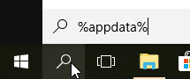

# Frequently Asked Questions

This is a collection of frequently asked questions for the ColossusCoinXT cryptocurrency.

**Important: if you have *any* problems with your wallet, always make a backup of your `wallet.dat` file and the backups that are stored in the `\backups` directory of the data directory.**

#### Why do I need to make a backup _now_?

Every time you start the wallet, an automatic backup of your wallet (`wallet.dat`) is created and put into the `\backups` subdirectory.
However, there are only 10 backups and the oldest backup is deleted to make room for the new one.

The wallet will also make a backup of your wallet file when it's corrupted. 
So if you start your wallet 10 times with a corrupted wallet, all good backup copies will be gone.

## List of common errors

- Error: A fatal internal error occured, see debug.log for details. TODO
- Runtime Error! Program: .../colx-qt.exe ("This application has requested the Runtime to terminate it in an unusual way")
- error: cannot parse configuration file: the options configuration file contains an invalid line. Only use key and value syntax.
- No blocksource available
- Masternode signing error, could not set key correctly: Invalid private key
- Assertion failed: !set blockindexcandidates:empty()
 
#### Where is my data directory containing my wallet, the blockchain files and the debug log?

##### Windows
On Windows, the default location is `C:\Users\USERNAME\AppData\Roaming\ColossusCoinXT`.

If the `AppData` folder is hidden, you can manually enter it in the address bar or you can use the Start Menu, Run or Search and enter `%appdata%` there.
That will usually take you directly to the `AppData\Roaming` directory.



##### Linux

On Linux, the default location is `~/.ColossusCoinXT`. `~` is your users' home directory. Type `cd ~/.ColossusCoinXT` to go there.

##### Mac

On Mac computers, go to `Mac > User > Me > Library > Application Support > ColossusCoinXT`.
The user library folder could be hidden, in that case see [helpx.adobe.com](https://helpx.adobe.com/x-productkb/global/access-hidden-user-library-files.html)


    
# General
 
### What is ColossusCoinXT (COLX)? 

ColossusCoinXT is a energy-efficient, environmentally friendly, anonymous cryptocurrency.
It is a 100% Proof of Stake (PoS) Coin.

### What was ColossusCoinV2 (CV2)?

ColossuscoinV2 (CV2) is the predecessor of COLX. It was already positioned as an energy-efficient, environmentally friendly cryptocurrency.
From september 28, 2017 to december 28, 2017 a coinswap was executed on NovaExchange. 
All CV2 coins were swapped for COLX coins at a 2:1 ratio.
 
### I have still CV2 coins, can I swap them?

No. All unswapped COLX coins have been burned bij NovaExchange.

# How do I install the wallet?

TODO

# Configuration

#### What do I need to put in my `colussusCoinXT.conf` configuration file?

On Windows or Mac, you can leave the file completely empty.

On Linux, you need to put a username and password in the file, e.g.:
```
rpcuser=colxrpcuser
rpcpassword=Jjhdjf8dfs939fjd
```

See next question for more details.

#### What `rpcuser` and `rpcpassword` should I use?

On Windows/Mac, you don't need them.
On Linux, you can use any value for `rpcuser` and `rpcpassword`, 
but the password should have alphanumeric characters only (no #, @, _). 

You can choose any password you like. 
All Linux tools read the password from the same config file, so it will always 'match'.

#### What do I need to put in my `masternodes.conf` configuration file?

# The wallet file `wallet.dat`

#### What's inside a wallet.dat file?

Your `wallet.dat` file contains:

- a seed: a random number that determines the list of 'random' COLX account numbers your wallet generates. Because of this seed, account numbers are predictable (deterministic) for the given seed. This makes it possible to use an old backup file and still retrieve funds from accounts that were created _after_ making the backup!
- Details of previous transactions;
- Account descriptions;
- Some configuration values;
 
#### Can I use my wallet.dat file from one machine to the other?

Yes. You can copy the file even between platforms, e.g. from you PC to your Mac or Linux server.
Don't use the same wallet.dat on multiple machines at the same time though, see below.

#### Can I copy my wallet.dat file and use it on two machines at the same time?

You can move your `wallet.dat` to another machine, 
but you should not use copies of the same wallet on different machines at the same time.

It may _seem_ to work at first (both wallets would show the correct balance) 
but if you generate a new account on one wallet and deposit coins, the other wallet wouldn't know about it.
Then, when you generate a new account on the second wallet, it would generate the _exact same account number_. 
This is problematic because:
- You might give the account a different name (thinking its new);
- the wallet would not expect any balance on the account, so it doesn't check the blockchain;
- your wallet would try to spend coins that may have been spent already by the other wallet.

You would need to repair the wallets with `-rescan` continuously to fix things.

#### I lost the passphrase to my wallet, how to get access to my coins?

To access an encrypted wallet, you *need* the passphrase, there's no other way.
Transaction ids and the like are _not_ enough.

If you lost your password, you _could_ try to use an old unencrypted backup to recover your funds (although the docs say it won't accept old unencrypted backups). 

#### Does the COLX wallet automatically create backups of my wallet.dat file?

Yes it does.

Every time you start the wallet, an backup copy of your wallet (`wallet.dat`) is added to the `\backups` subdirectory.
You will find up to 10 backups there.
Both `wallet.dat` and the `\backups` directory are in the data directory (see "Where is my data directory" above).

#### How can I open my wallet.dat file?

The `wallet.dat` file is a binary (database) file, only the wallet software (and Berkely database toold) can open the file. 

Although some Windows machines are configures to open Notepad when you double-click a wallet file, you should not open it with a text editor and definitely not save it with it.
It will damage the wallet file.
Only use operating system tools to move or rename wallet files, e.g. Windows explorer (drag/drop) or `cp`/`mv` on Linux.

# The blockchain files

#### How do I solve my blockchain problems?

Blockchain problems are easy to fix.
You can simply delete the blockchain files.
The wallet will re-download the blockchain automatically.

To remove and recreate the (corrupt) blockchain files:

- Close the wallet;
- Go to your data directory (see "Where is my data directory" above);
- Backup `wallet.dat` and `\backups` (just in case);
- Remove the `blocks`, `chainstate`, `database` directories;
- Restart the wallet and let it sync again. Your balance will be 0 at first but it will reappear as the blockchain is loaded.

## Syncing

#### What is syncing?

Synching means the wallet loads the blockchain (containing all transactions ever made) from other wallets.
You need connections to other wallets for that.

#### My wallet is not syncing / has no connections, what can I do?

To start the syncing process, you need to connect to at least 1 other wallet.
This should be automatic as the wallet contains some hardcoded servers to connect to, but due to a bug this does not seem to work at the moment.
Therefore you need to connect to a node manually:

- Look up an recent COLX addnodes list, e.g. the [presstab.pw nodes list](http://www.presstab.pw/phpexplorer/COLX/nodes.php): 
- Then either:
	- Open Tools, Debug console and enter `addnode 1.2.3.4 add` (replacing 1.2.3.4 with a valid IP address, or
	- Open Tools, Wallet Configuration, copy/paste the `addnode=1.2.3.4` lines to your configuration and restart.

#### My wallet is fully synchronized, but my coins are not there?

- First, use a blockchain explorer to check the account and see if the balance is really there!
- To see the balance in your wallet, make sure you have the `wallet.dat` file that contains the account. 
  You other `wallet.dat` if you:
	- deleted the `wallet.dat` file (in that case, close wallet, replace `wallet.dat` with the original backup from `\backups`, restart wallet);
	- run the wallet with another user account (in that case, open the wallet with the right user account)
	- run the wallet with another data directory (e.g. -datadir=\some\path)
- If you are sure you have right `wallet.dat` and still don't see your balance, you can ask the wallet to rescan the blockchain (Tools, Repair Wallet, -rescan)). 

## Staking

#### What is staking?

Staking means you keep your wallet online to add blocks (of COLX transactions) to the blockchain, just like miners do.
Each time your wallet adds a block, you get a reward for that.

#### What is the difference between (Proof of Work) mining and (Proof of Stake) staking?

With (Proof of Work) mining, you need a lot of computer power to create blocks. The more (hash)power you have, the more blocks you will create.

With (Proof of Stake) staking like COLX, you need coin balance to create blocks. The more coins you have, the more blocks you will create.

###### How can I start staking my coins?

All you need is to keep your wallet open. 
Your coins need to be in their account for at least 7 days (see "maturity").

If your coins are not mature yet, you do not need to keep you wallet open to let them mature.
It's a blockchain thing, not a wallet thing.

###### How do I check if my wallet is staking?

- TODO: hover bottom right

### My wallet is staking, how much staking rewards will I get?

That depends on the number of (mature) coins you have and the number of staking coins on the network.
If you own 0,1% of the staking coins, you would create 0,1% of the blocks (on average).

The block time for COLX is 1 minute. So there is 1 COLX block per minute, 60 per hour 1440 per day on average.
So if you own 0,1% of the staking coins, you will get around 1,44 blocks / day.

In reality, staking revenue is around 1,5% per month.

### What is maturity?

The maturity of a coin indicates how long it has been since it was transferred to its account.

If you transfer coins to your account, their maturity will start at 0.
One day later, their maturity will be 1 day.
For coins to stake, they need to have a maturity of 1 week.
If your transfer coins (of if they stake) their maturity resets to 0 again.

Maturity is roughly the same as 'confirmations', but confirmations are measured in blocks (1 every minute).
If you transferred coins to your account, they have 0 confirmations (maturity: 0).
One day later, when (on average) 1440 blocks have been added to the blockchain, they will have 1440 confirmations (maturity: 1 day).

### My coins are mature, but my wallet is not staking?

- getstakinginfo
- restart wallet (dus to PIVX bug)

## Coin block splitting

### What are (coin) blocks and why would I split them?

##### How can I see what (coin) blocks are in my wallet?

- TODO: enable coin control, Send Tab, Inputs
- confirmations = maturity. 

##### How do I split my coins?

- TODO: enable coin control, Send Tab, Inputs.
- buggy
- fees

## Running a Masternode 

#### What is a masternode?

#### What do I need to put in my `masternodes.conf` configuration file?

###### How can I check if my masternode is running?

- TODO: check debug.log for 'Enabled!'

#### I'm running a masternode, how much masternode rewards will I get?

That depends on the number of masternodes. One masternode is paid with every block (=every minute).

If there are 60 masternodes, your masternode would get a reward every 60 minutes (on average).
If there are 200 masternodes, your masternode would get a reward every 200 minutes (3 hours 20 minutes).

The masternode reward is about 720 COLX.

### How do I determine the total number of masternodes?

There are various websites that tell you that, like [masternodes.pro](https://masternodes.pro/stats/colx);
You can also use the Debug Console (Tools, Debug Console) and enter `masternode list` to get a list.

## Coin Control

## What is Coin Control?

Coin control enables the advanced features of the wallet:
- In the Send tab, you can use the 'Inputs...' button to select specific coin blocks to be included in your transaction. You can also check the maturity of your coins there.
- On the Send page, you have the option to split your coins 

## How do I enable Coin Control in my wallet?

- Go to menu Tools, submenu Options, tab Wallet.
- Check 'Enable Coin Control'
 